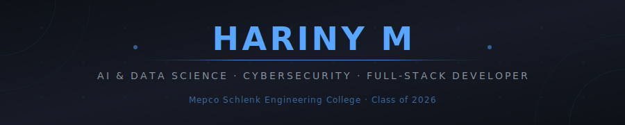

<div align="center">
  
</div>

<br/>

<div align="center">
  
  [](https://git.io/typing-svg)

</div>

<div align="center">

[](https://linkedin.com/in/harinym11204)
[](https://github.com/harinym112)
[](https://leetcode.com/Hariny_Mathavan)
[](mailto:aishuhariny@gmail.com)
[](#)

</div>

---


## 👩‍💻 About Me

> *B.Tech AI & Data Science graduate (Cybersecurity Honors) from **Mepco Schlenk Engineering College**, Sivakasi — building production-grade AI systems, secure full-stack apps, and real-time platforms.*

- 🎓 **B.Tech AI & Data Science** (Hons. Cybersecurity) — **CGPA: 7.98 / 10.0** | Class of 2026
- 🔐 Passionate about **Cybersecurity** — E2E encryption, ethical hacking, digital forensics
- 🛸 Built a **drone detection system** achieving **~94% accuracy** — under journal review
- 🏆 **2× 1st Prize** at Paper Presentations | **2× Smart India Hackathon** participant
- ☁️ **AWS Cloud Practitioner** | Certified Digital Forensic Analyst | Ethical Hacking certified
- 🌐 Fluent in **English & Tamil** | Basic **Japanese**
- 📍 Madurai, Tamil Nadu | Open to **Cybersecurity · AI/ML · Full-Stack roles**

<br clear="right"/>

---

## 🎯 What I'm Up To

```text
🔭  Currently     →  Publishing drone detection research (under journal review)
🌱  Learning      →  Advanced red teaming & cloud security (AWS Security Specialty)
👯  Looking to    →  Collaborate on AI + security intersection projects
💬  Ask me about  →  PyTorch · Socket.io · AES encryption · ISL recognition
⚡  Fun fact      →  I debug security flaws the same way I debug code — methodically
```

---

## 🚀 Featured Projects

<table>
<tr>
<td width="50%" valign="top">

### 🛸 Cognitive Drone Detection
> *Python · PyTorch · Streamlit*

**📄 Under Journal Review**

- RF-based deep learning classifying **17+ drone types** at **~96% accuracy**
- Dual-branch adaptive fusion architecture for GPS localization
- Real-time Streamlit dashboard for detection visualization

[](.)

</td>
<td width="50%" valign="top">

### 🔐 SecureChat — E2E Messaging
> *React · Node.js · Socket.io · MongoDB · Docker*

- **AES-256-GCM** encryption + ECDH key exchange + perfect forward secrecy
- Supports **50+ concurrent users** with **<150ms** message delivery latency
- Defenses against MITM, replay & XSS attacks

[](https://github.com/harinym112/SecureChat)

</td>
</tr>
<tr>
<td width="50%" valign="top">

### 💻 CodePulse — Coding Platform
> *React · Node.js · Socket.io · MongoDB · Docker*

- Real-time editor supporting **30+ simultaneous users**
- Instant judging for **2+ programming languages**
- OT-inspired conflict resolution — zero edit collisions

[](https://github.com/harinym112/CodePulse-OnlineCodingPlatform)

</td>
<td width="50%" valign="top">

### 🤖 AI Resume Builder + ATS Analyser
> *Node.js · MongoDB · Gemini API*

- Full-stack builder with ATS scoring & keyword gap analysis
- PDF export via **Gemini API** with automated keyword suggestions
- Measurably improves ATS turnaround rates

[](https://github.com/harinym112/AI-Resume-Builder-ATS-Analyser)

</td>
</tr>
<tr>
<td width="50%" valign="top">

### 🤟 ISL Translator & Tamil OCR
> *Python · OpenCV · MediaPipe · TensorFlow · LSTM*

- Real-time ISL gesture → text & speech at **88%+ accuracy**
- Tamil handwritten OCR → English translation at **85%+ accuracy**
- Bridges accessibility gaps for hearing-impaired communities

[](.)

</td>
<td width="50%" valign="top">

### 🍽️ FlavorQuest
> *TypeScript · React · Vite · Tailwind CSS*

- Recipe discovery with category filtering & keyword search
- Component-driven with reusable TypeScript interfaces
- Fully responsive — optimized for mobile & desktop

[](https://github.com/harinym112/FlavorQuest)

</td>
</tr>
</table>

---

## 🛠️ Tech Stack

<div align="center">

### Languages


### AI / ML


### Full-Stack


### DevOps & Cloud


### Cybersecurity


</div>

---

## 📊 GitHub Stats

<div align="center">
  
  
</div>

<div align="center">
  
</div>

<div align="center">
  
</div>

---

## 🏆 Achievements

<div align="center">

| 🏅 Award | 🏛️ Organization | 📅 Year |
|:---------|:----------------|:--------|
| 🥇 **1st Prize** — Paper Presentation (TechClustres) | Kongunadu College of Engineering | 2024 |
| 🥇 **1st Prize** — Paper Presentation (TechMeraki) | PSNA College | 2024 |
| 🏆 **Smart India Hackathon** Participant | Govt. of India | 2023, 2024 |
| 🎓 **Management Scholarship** × 3 | Mepco Schlenk Engineering College | 2022–2025 |
| 🏆 **1st Prize** — Online Quiz (Apti Riders Forum) | Mepco Schlenk | 2023 |
| 🤝 **Secretary, NSS** | National Service Scheme | 2023–2024 |

</div>

---

## 📜 Certifications

<div align="center">


-NPTEL-F96C1B?style=for-the-badge)


</div>

---

## 🤝 Let's Connect

<div align="center">

I'm always open to collaborating on **AI/ML research**, **security tools**, or **full-stack projects**. Feel free to reach out!

[](https://linkedin.com/in/harinym11204)
[](mailto:aishuhariny@gmail.com)

</div>

---

<div align="center">


*"Security is not a product, but a process." — Bruce Schneier*

</div>
